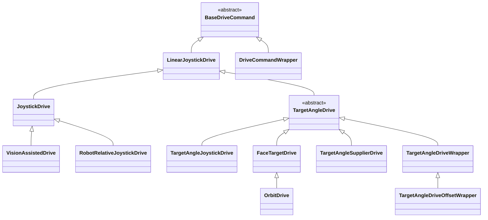
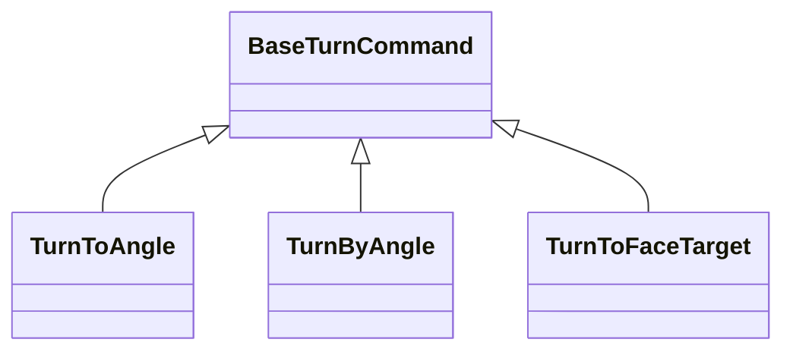

## Swerve Drive Commands



- `BaseDriveCommand` - defines the core driving logic and provides abstract methods to be overridden in child classes for specifying movement speeds.

- `LinearJoystickDrive` - provides a very simple drive implementation with zero turning ability. This allows us to easily extend it and provide custom turning functionalities.

- `JoystickDrive` - this is the default swerve drive command. By default, movement is relative to the driver's perspective (field relative), not the robot's (robot relative). This allows the driver to move and spin the robot independently of eachother (homonomic drive). For robot relative mode, simply use the `withFieldRelative(false)` method.

- `TargetAngleDrive` - this is an abstract class which extends from `LinearJoystickDrive`. That means it has all the functionality to move linearly, and it is expected that subclasses of `TargetAngleDrive` implement a desired target angle for the robot to face.

- `DriveCommandWrapper` - Similar to WPILib's `WrapperCommand`, this class is used to wrap specifically drive commands, allowing you to change (or extend) one or more functionalities of the wrapped class. The main purpose for this is to create builder methods like `BaseDriveCommand#withFieldRelative()`. See `DriveCommandBoundaryWrapper` for a more concrete example.

- `DriveCommandBoundaryWrapper` - Using the robot's pose, prevent the robot from moving outside the field's bounds.

- `TargetAngleDriveOffsetWrapper` - Used to offset the desired angle of a `TargetAngleDrive` subclass. For example, say you are using `FaceTargetDrive`, but you would like the robot to face **away** from the target, you can use this class to wrap the drive command with an offset of 180 degrees.
```java
TargetAngleDrive driveCommand = new FaceTargetDrive(m_drive, exampleTargetPose);
BaseDriveCommand offsetDriveCommand = new TargetAngleDriveOffsetWrapper(driveCommand, ..., Rotation2d.fromDegrees(180));

// or using the helper method
BaseDriveCommand offsetDriveCommand = new FaceTargetDrive(m_drive, ..., exampleTargetPose).asInverted();
```

## Swerve Turning Commands

